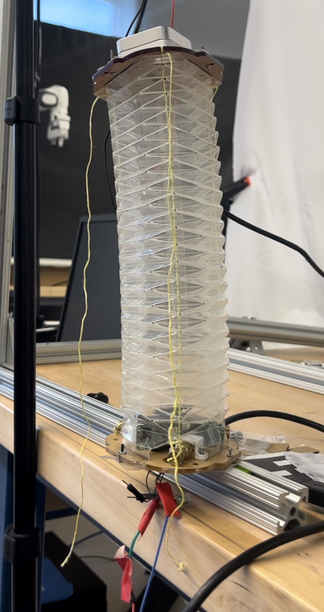
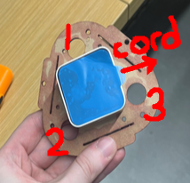
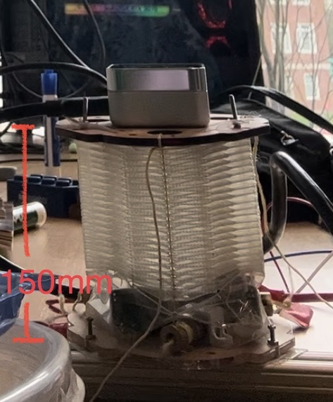
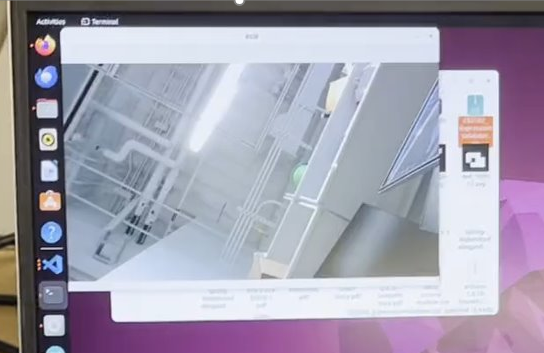

# About Origami Visual Servo
Origami Visual Servo is a public repository to help get started with visually servoing an origami module, logging ROS2 data, and communicating between ROS2 and an Arduino. 

Created with mentorship/collaboration from the Manipulation and Environmental Robotics lab at Worcester Polytechnic Institute.

# Getting Started
## Prerequisites
<ul>
<li><a href='https://docs.ros.org/en/humble/Installation.html'>ROS2 Humble</a></li>
<li><a href='https://www.mathworks.com/help/install/ug/install-products-with-internet-connection.html'>Matlab</a></li>
<li><a href='https://opencv.org/get-started'>OpenCV</a></li>
<li><a href='https://github.com/IntelRealSense/realsense-ros'>RealSense ROS</a></li>
</ul>

## Installation
1. Clone the repo

        gh repo clone jshaughnessy24/origami_visual_servo

2. 'cd' to origami_visual_servo

3. To install dependencies, run

        rosdep install --from-paths --ignore-src ros2_ws -y
4. Run 

        cd ros2_ws
        colcon build

## Module Setup
If you do not have an origami module, create one using these [instructions](./origami_hardware/README.md). Using the [instructions](./origami_hardware/README.md), also create a motor plate with a mount and a T-slotted framing rail mount.

Mount a Realsense D405 Camera in the center position to the motor plate.
Your module should look similar to the one depicted below:

    
    

You must make sure that the camera's cord is in the correct position so the image jacobian is correct.

## Arduino Setup
1. Once all motors have been tested, daisy-chained, and connected to the Arduino using the [schematics](./origami_hardware/resources/Job1.PDF), upload [module_motor_control_v2.ino](./resources/module_motor_control_v2/module_motor_control_v2.ino) to the Arduino.

**Warning.** Make sure to modify the motor addresses in [module_motor_control_v2.ino](./resources/module_motor_control_v2/module_motor_control_v2.ino) if they do not match the order depicted below:

    

        
        const int motorAddresses[numMotors] = {1,2,3};

To explain, the motor corresponding to the address motorAddresses[0] must be located in the area labeled 1 in the image, the motor corresponding to the address motorAddresses[1] must be located in the area labeled 2 in the image, and so on. 

2. Open up the serial monitor. Lines of the following form should print rapidly:

    "[motor1_encoder_counts] [motor1_velocities] [motor1_currents] , [motor2_encoder_counts] [motor2_velocities] [motor2_currents] , [motor3_encoder_counts] [motor3_velocities] [motor3_currents] ,"

    ex. "0 0 0 1 0 0 0 219 ,0 0 0 1 0 0 0 115 ,0 0 0 1 0 0 0 129 ,"

3. Type "10 0 0" into the serial monitor and press enter. 
    
    motor1 should move at 10rpm, motor2 at 0rpm, and motor3 at 0rpm. Try different values to make sure serial communication functions properly.

## Visual Servoing Demo
1. Print out the following Aruco Marker: [Online_ArUco_markers_generator_12.pdf](./resources/Online_ArUco_markers_generator_12.pdf).
1. Using the serial monitor and [module_motor_control_v2.ino](./resources/module_motor_control_v2/module_motor_control_v2.ino), compress the module evenly to 150mm tall. Be sure to type in positive rpms or the module will move away from the desired configuration.

    

2. Close the serial monitor.
3. 'cd' to ros2_ws.
4. Run

        source install/setup.bash
5. Run

        bash src/projects/origami_arm/origami_eye_in_hand/scripts/origami_eih_exp.sh

6. Input an experiment number (ex. 0).
7. You should now see a popup window containing the camera's stream: 

    

8. Pick up the printed aruco marker and place it in front of the camera stream. 

     You should now see 2 orange points, representing the desired marker positions and 2 red points representing the current marker positions. 
     
     The module should start servoing the red points towards the orange points and stop once the motor velocities reach under 1 rpm.

    

9. Once the program has stopped, open up the directory "~/Pictures/origami_eye_in_hand/test." Data collected from the program should be stored within.

10. For more formal experiments, you should adjust the camera intrinsics, described further below.

# origami_msgs
origami_msgs is used to communicate between ROS2 and the arduino program [module_motor_control_v2.ino](./resources/module_motor_control_v2/module_motor_control_v2.ino).

## Commanding motors to move at specific rpms
Publish a Float64MultiArray to the topic motor_desired_velocities of the form [[motor1 rpm], [motor2 rpm], [motor3 rpm]].

For example, a sent array of the form [10, 0, 0] would command motor1 to move at 10 rpm while motor2 and motor3 stay in place.

        self.publisher_motor_desired_velocities = self.create_publisher(Float64MultiArray, 'motor_desired_velocities', 0)
        
        # publish desired velocities
        desired_velocities = Float64MultiArray()
        desired_velocities.data = [10, 0, 0]
        self.publisher_motor_desired_velocities.publish(desired_velocities)

# origami_eye_in_hand
origami_eye_in_hand contains the visual servoing code for the program. The file [velocity_controller.py](./ros2_ws/src/projects/origami_arm/origami_eye_in_hand/origami_eye_in_hand/velocity_controller.py) is the center of program, subscribing for markers and publishing velocities to send to the motors. 
## Setting desired centers
In [velocity_controller.py](./ros2_ws/src/projects/origami_arm/origami_eye_in_hand/origami_eye_in_hand/velocity_controller.py) change the assignment in the lines
                
        self.m1_center_desired = [695.25, 257.25]
        self.m1_corner_desired = [669.0, 229.0]

to the desired center pts, in pixels.
## Setting tendon mm per rev
In [velocity_controller.py](./ros2_ws/src/projects/origami_arm/origami_eye_in_hand/origami_eye_in_hand/velocity_controller.py) and [motor_controller.py](./ros2_ws/src/projects/origami_arm/origami_msgs/origami_msgs/motor_controller.py), 
after measure the amount of string wound per revolution, adjust the assignment in the line

        self.tendon_mm_per_rev = 7 * math.pi 

to the desired length.

## Setting camera intrinsics
In [velocity_controller.py](./ros2_ws/src/projects/origami_arm/origami_eye_in_hand/origami_eye_in_hand/velocity_controller.py), change the lines

        self.focal_length_x = 430.3659973144531 
        self.focal_length_y = 429.81927490234375 
        self.principle_pt_x = 426.06097412109375
        self.principle_pt_y = 244.31988525390625
        self.pixel_dim_ratio = 4/3 

to the measured camera intrinsics.

## Setting visual servoing gain
In [velocity_controller.py](./ros2_ws/src/projects/origami_arm/origami_eye_in_hand/origami_eye_in_hand/velocity_controller.py), change the line

        gain = 1 / 50

to the desired gain.

# origami_data_logging
origami_data_logging can be used to subscribe to any ROS2 topic and write to a db3 bag file at a set rate. In addition, it can be used to create a video and gif of an image stream, as well as visualize origami visual servoing data.

## Recording ROS2 topics
In [bag_data_logger.py](./ros2_ws/src/projects/origami_arm/origami_data_logging/origami_data_logging/bag_data_logger.py), add a 'title' in self.title_to_data_type_dict with a desired ROS2 topic name. In addition, add the data type of the ROS2 topic. In self.data_type_to_msg_type_dict, take the data types you've added to self.title_to_data_type_dict, and correspond them to message types (i.e. the classes themselves rather than a class name string).

        self.title_to_data_type_dict = {
                'marker_coordinates'                    :'std_msgs/msg/Float64MultiArray', # each marker has its own entry--split every 3
                'marker_desired_coordinates'            :'std_msgs/msg/Float64MultiArray',
                'tendon_lengths'                        :'std_msgs/msg/Float64MultiArray', # each motor has its own entry 
                'motor_velocities'                      :'std_msgs/msg/Float64MultiArray', # each motor has its own entry
                'motor_desired_velocities'              :'std_msgs/msg/Float64MultiArray', # each motor has its own entry
                'motor_encoder_counts'                  :'std_msgs/msg/Float64MultiArray', # each motor has its own entry--split every 4
                'xz_cam_desired_velocity'               :'std_msgs/msg/Float64MultiArray', # desired xz camera velocity
                'xz_cam_desired_velocity_norm'          :'std_msgs/msg/Float64', 
                'marker_coordinates_image_errors'       :'std_msgs/msg/Float64MultiArray',
                'marker_coordinates_image_errors_norm'  :'std_msgs/msg/Float64',
                'camera_interaction_matrix'             :'std_msgs/msg/Float64MultiArray',
                'robot_jacobian'                        :'std_msgs/msg/Float64MultiArray',
                'end_flag'                              :'std_msgs/msg/Bool',
                }

                self.data_type_to_msg_type_dict = {  # couldn't find a function for it on my own, but it'd probably be like this anyways.
                'std_msgs/msg/Float64MultiArray' : Float64MultiArray,
                'std_msgs/msg/Float64'           : Float64,
                'sensor_msgs/msg/Image'          : Image,
                'std_msgs/msg/Bool'              : Bool
                }

## Setting bag storage location
In [bag_data_logger.py](./ros2_ws/src/projects/origami_arm/origami_data_logging/origami_data_logging/bag_data_logger.py), change the uri in the line

        storage_options = rosbag2_py._storage.StorageOptions(
            uri='src/projects/origami_arm/exp_log/' + str(now).replace(" ","_"),
            storage_id='sqlite3')

In addition, change the line 

        export bag_path=$(find -L ~/origami_visual_servo/ros2_ws/src/projects/origami_arm/exp_log -name "*.db3")

in [origami_eih_bag_to_csv.sh](./ros2_ws/src/projects/origami_arm/origami_data_logging/scripts/origami_eih_bag_to_csv.sh) to reflect the new bag path.

## Getting csv files from the ros2 bag
In [origami_eih_bag_to_csv.sh](./ros2_ws/src/projects/origami_arm/origami_data_logging/scripts/origami_eih_bag_to_csv.sh), change the lines of the form

        sqlite3 -header -csv $bag_path "select * from messages where topic_id = (select id from topics where name = 'marker_coordinates');"            > ~/origami_visual_servo/ros2_ws/src/projects/origami_arm/exp_log/marker_coordinates.csv

to reflect your own topics and csv locations. The selection 'name' corresponds to the topic name.

## Creating video from an image stream
Publish compressed images to the 'compressed_color_img' topic and run the [image_to_video_converter.py](./ros2_ws/src/projects/origami_arm/origami_data_logging/origami_data_logging/image_to_video_converter.py) node.

One way to send a compressed image is shown below:

        self.publisher_compressed_color_img = self.create_publisher(CompressedImage, 'compressed_color_img',0)

        # slightly modified from http://wiki.ros.org/rospy_tutorials/Tutorials/WritingImagePublisherSubscriber
        #### Create CompressedImage ####
        msg = CompressedImage()
        msg.header.stamp = self.get_clock().now().to_msg()
        msg.format = "jpeg"
        msg.data = np.array(cv2.imencode('.jpg', bgr_img)[1]).tostring()
        
        self.publisher_compressed_color_img.publish(msg)

## Getting gif from video
In [origami_eih_bag_to_csv.sh](./ros2_ws/src/projects/origami_arm/origami_data_logging/scripts/origami_eih_bag_to_csv.sh), the line 

        ffmpeg -t 60 -i ~/origami_visual_servo/ros2_ws/src/projects/origami_arm/exp_log/output_video.mp4 -filter_complex "[0:v] split [a][b];[a] palettegen [p];[b][p] paletteuse" ~/origami_visual_servo/ros2_ws/src/projects/origami_arm/exp_log/output_gif.gif

converts the output video to a gif.

## Plotting origami data
After creating csv files from the origami bag data, in [plot_shape_grow_sim.m](./ros2_ws/src/projects/origami_arm/origami_data_logging/scripts/plot_shape_grow_sim.m), adjust the folder path

        folder_path = "~/origami_visual_servo/ros2_ws/src/projects/origami_arm/exp_log/";

to reflect the directory in which the csv files are stored.

Then, run the matlab script. One way to do this is to cd to the directory of [plot_shape_grow_sim.m](./ros2_ws/src/projects/origami_arm/origami_data_logging/scripts/plot_shape_grow_sim.m) and run

        matlab -nodisplay -r "plot_shape_grow_sim; exit"

You should get graphs similar to the pngs in the folder [259 pos 5](./resources/data_examples/259%20pos%205).

    