

# Origami arm build process
## Parts list
1. 3 plastic sheets
2. 3 motors and motor boards
3. 2 [motor plates](#creating-a-motor-plate)
4. 5 feet of thread
5. 3 motor holders
6. 6 motor holder screws
7. 6 motor holder hex nuts
8. 3 additional screws
9. 3 additional nuts
10. Arduino board w/ i^2 C
11. Arduino connector
12. 3 motor wire connectors
13. (optional) 1 [mount for 1x1 inch 80-20 T-slotted framing rails](#creating-a-t-slotted-framing-rail-mount)

## Building a module

### Build origami body

1. Laser cut plastic sheets.

You should have three sheets similar to the one pictured below--annotations have been used to label areas that will be referenced in later sections of this document:
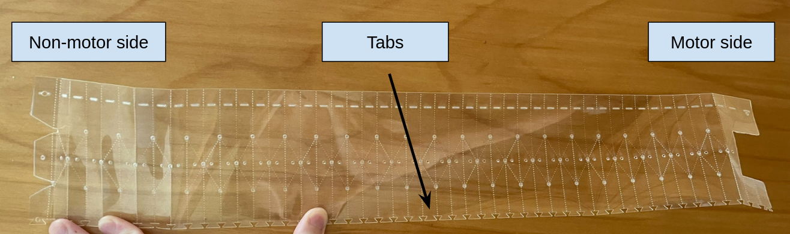

2. Fold plastic sheets.

Follow the picture below for the length of each sheet:
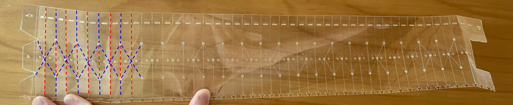
Red means fold inward.  
Blue means fold outward.  

The tabs should be consistently in the same position for every sheet. Otherwise, the sheets may not connect together.
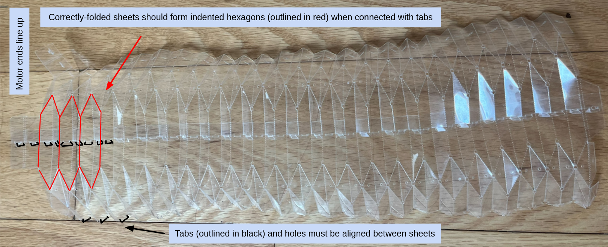

3. Connect folded sheets together.

Attach sheets by inserting the tabs on one sheet into to the holes on another.   

Make sure that the tabs points towards the inside of the module. Otherwise, the module 
will bend outwards at each connection.  

For ease, it is recommended to use tweazers to fold tabs and connect them. Recommended folds are pictured in green below.
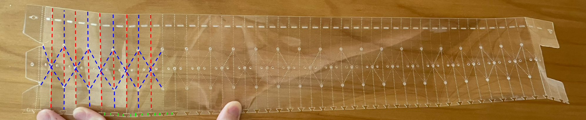

2 connected sheets:  
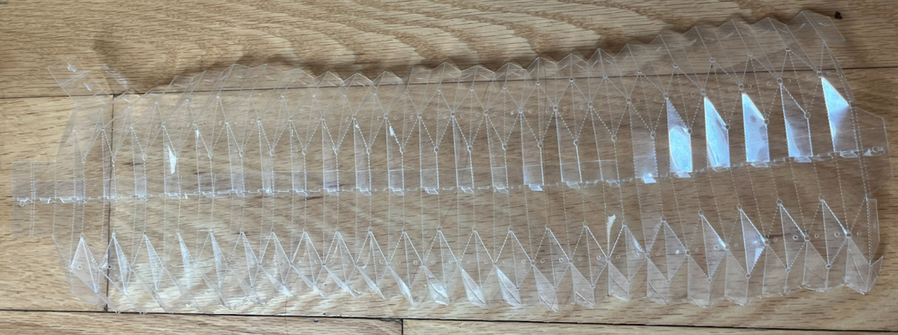
Connected module body:
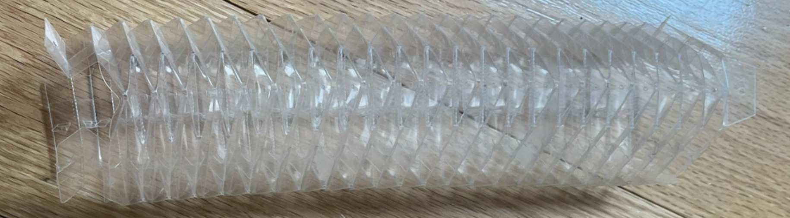

4. Thread all three sides of folded module with needle.

Tie strings on last hole of non-motor end. Leave at least 6 inches of excess thread on motor end.

    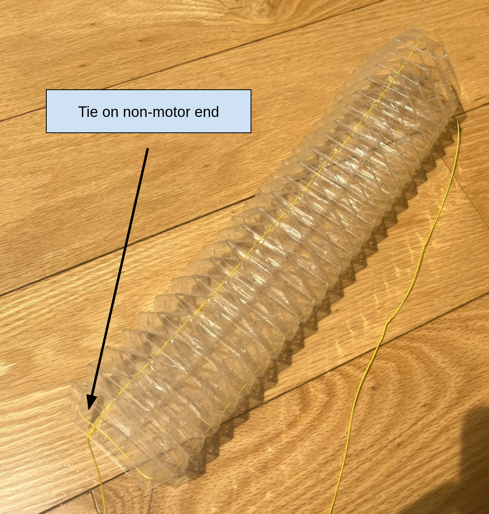

        
### Set up motors
5. Solder motors to motorboards.  

Follow the picture below for each motor:

    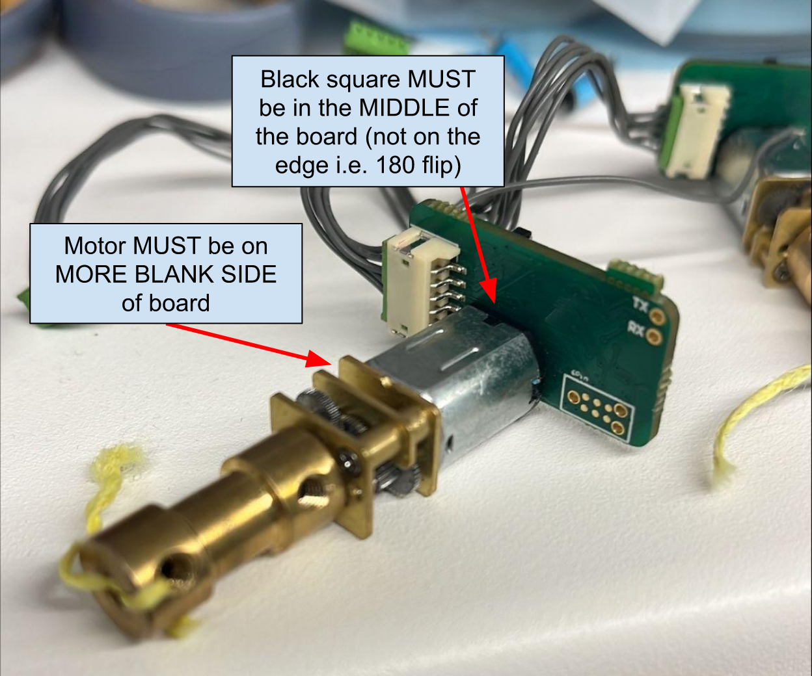

To solder, using a clamp to hold the motor and motorboard together is preferable.  

6. Attach magnets to motors.

    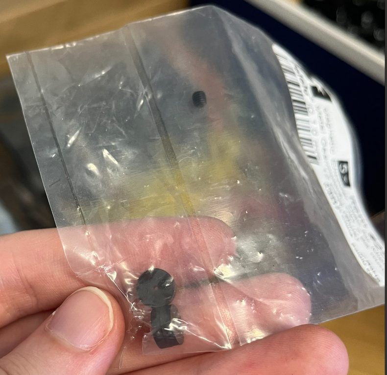
     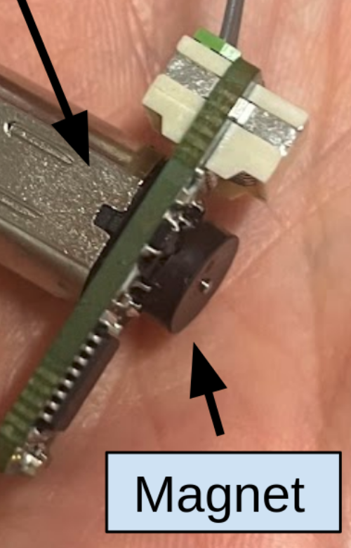

7. Download and open [Arduino IDE](https://www.arduino.cc/en/software).
8. Follow steps to install [MiniCore](https://github.com/MCUdude/MiniCore).
9. In Arduino IDE, go to "File" -> "Examples" -> "ArduinoISP".

    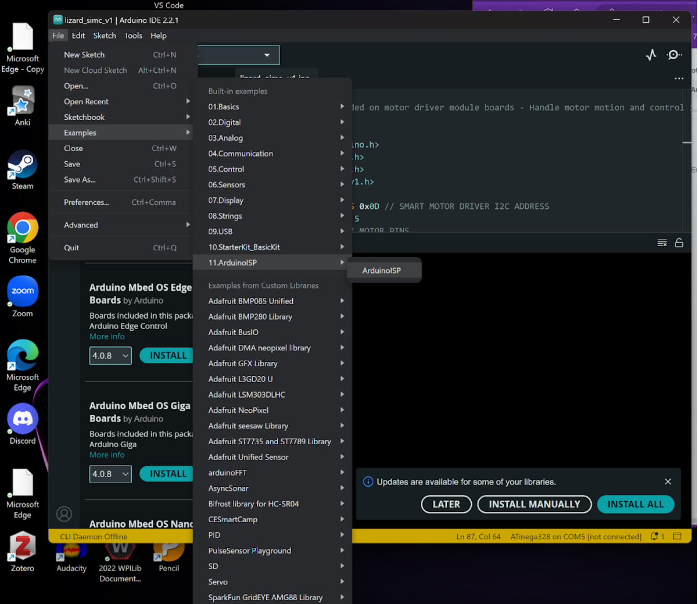

10. Upload "ArduinoISP" to an (in this example) ATmega328 board.

    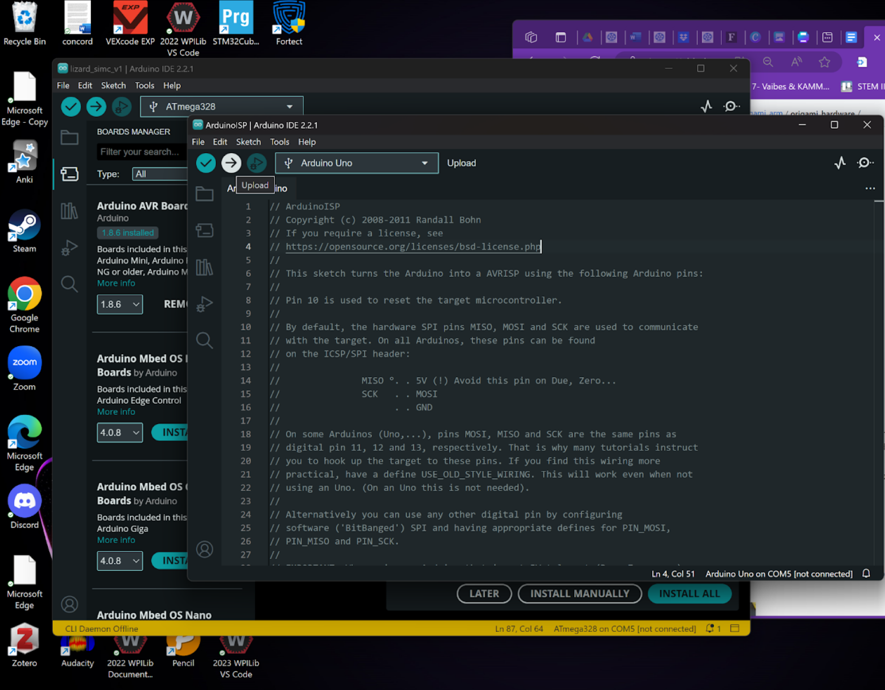

11. Open the [lizard_simc_v1.ino](./resources/lizard_simc_v1.ino) file in Arduino IDE.
12. Go to "Tools" -> "Board" -> "MiniCore" -> "ATmega328".

    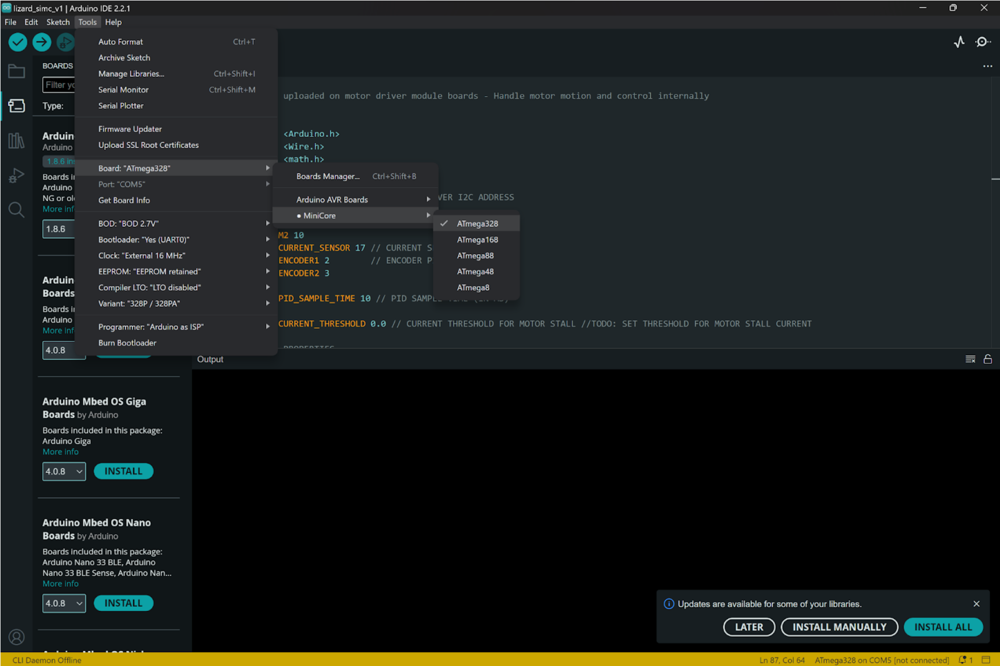

13. In "Tools," make sure:  
Board: ATmega328   
Variant: 328P / 328PA  
Programmer: Arduino as ISP
14. Take note of the "SMART MOTOR DRIVER I2C ADDRESS". It represents the ID/number that I2C uses to communicate with each motor. Must be changed for all subsequent motors. In addition, gear ratios may need to be adjusted in the file.
15. Press the 5-pronged connector (which is attached to the ATmega328) to a motorboard.
16. Go to "Tools" -> "Burn Bootloader"
17. While still connected, go to "Sketch" -> "Upload Using Programmer"
18. After finished, the motor should be set up. Repeat for all remaining motors.

### Check motor function
19. Daisy-chain 3 motors together. It should look something like the picture below (but not attached to the endplate yet)

    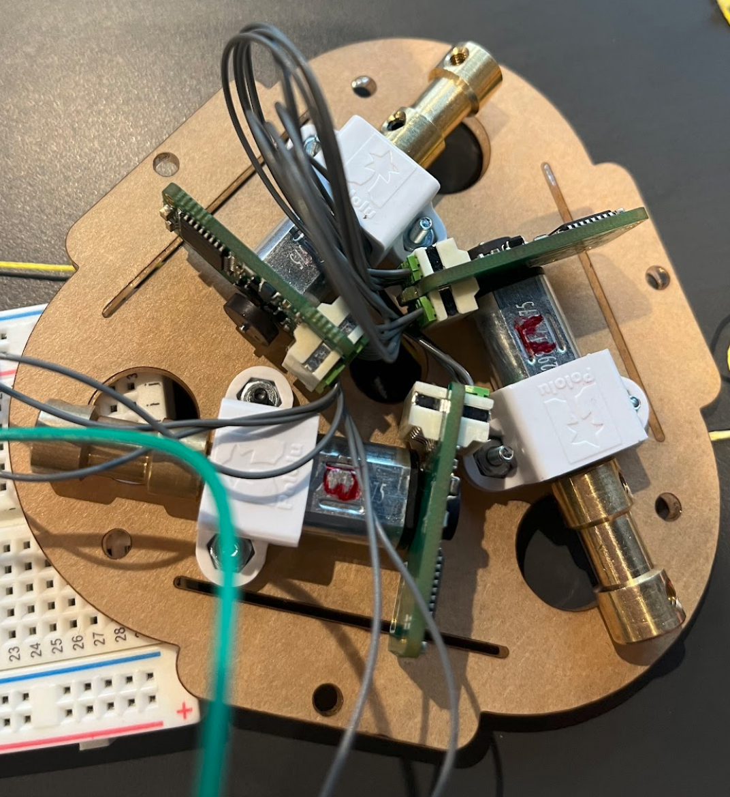

20. Connect one of the motors to the arduino board according to the [schematics](./resources/Job1.PDF), i.e. connect corresponding motor and arduino pins. A 6V power supply may be required depending on the motor make.
21. Upload [motor_checker.ino](./resources/motor_checker/motor_checker.ino) to the arduino to check a motor. Make sure the address is correct for each motor. The motor should start and stop moving at .5 second intervals.
22. If all the motors work, continue to the next step. Otherwise, repeat this section with different motors.

### Connect motors and module body
23. Using the motor screws and nuts, attach the motors and motor holders to the endplate.   

Make sure they are still daisy-chained as it may be difficult to connect them later.  

Make sure that the wire connectors all point towards the center of the endplate. Otherwise, it will interfere with the main module body when that is attached.

Reference picture: 

    

24. Tie the excess origami module string to each motor. Take care that string does not overlap.
25. Attach the origami module body to the endplate using screws and nuts on the motor end.

As you do this step, try taping the wires from the motor connected to the arduino together to keep them in order.

    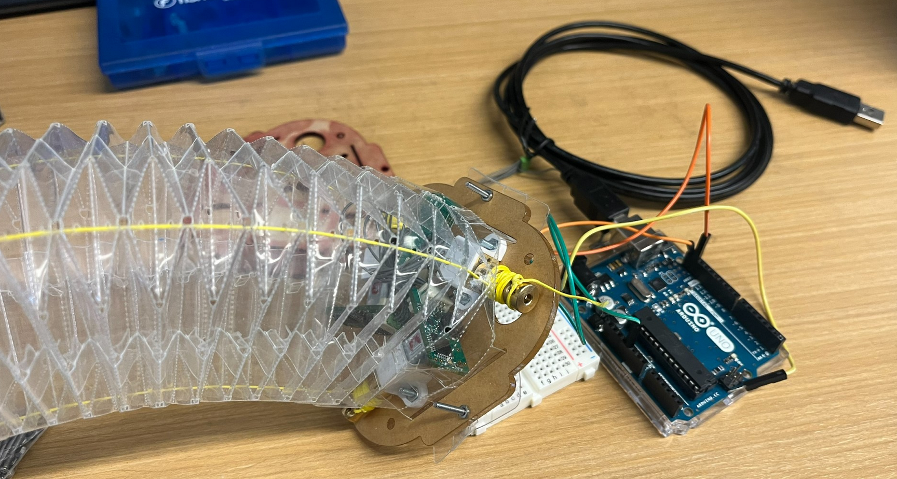

26. The origami module should be complete.

    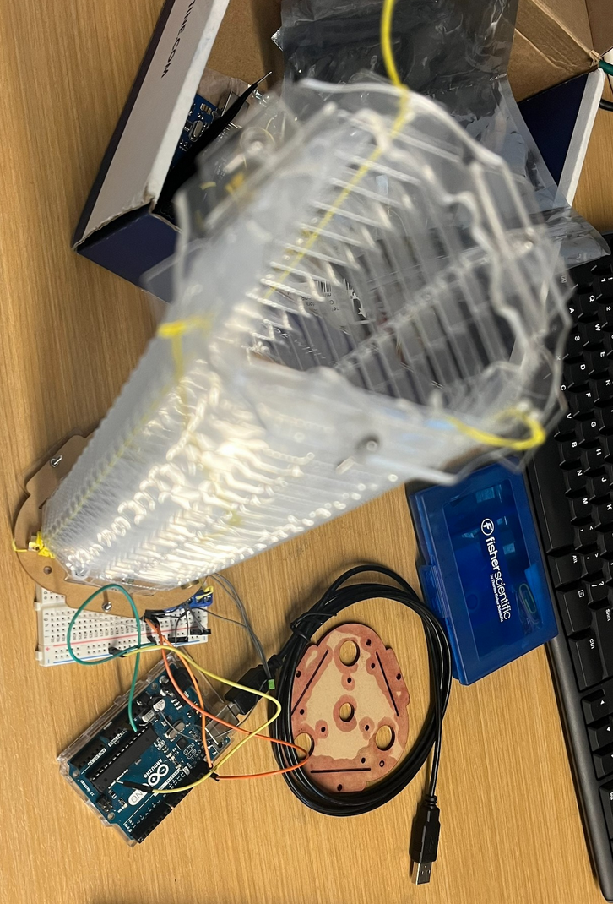
    

## Miscellaneous
### Creating a motor plate
The Parasolid files for 2 motor plates are found below: 
1. [Motor plate with holes for a Realsense D405 camera mount](./resources/end_plate/origami_end_plate_with_camera_mount.x_t)
2. [Motor plate without camera mount](./resources/end_plate/origami_end_plate.x_t)

The motor plate without a mount is used throughout the readme.

The camera mounted positions are found below:

    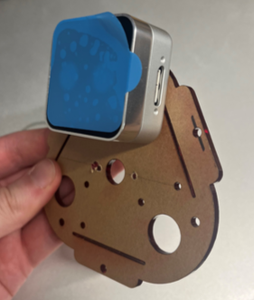
    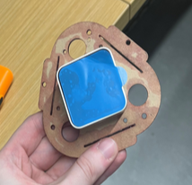

### Creating a T-slotted framing rail mount
[Parasolid file for a mount for 1x1 inch 80-20 T-slotted framing rails.](./resources/80-20_slider.x_t)

    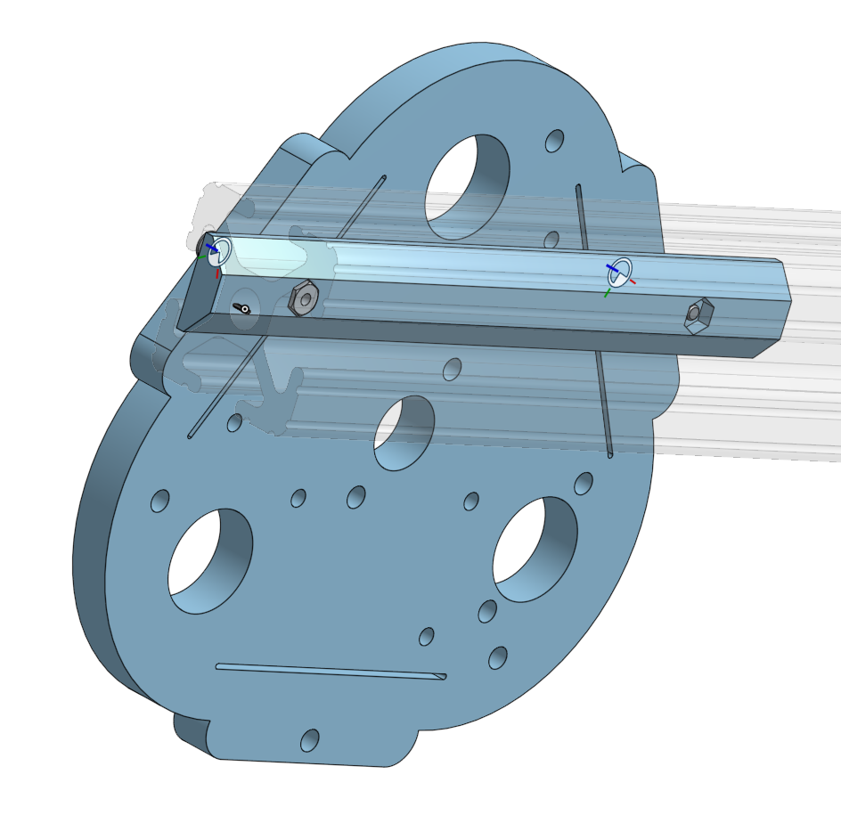

